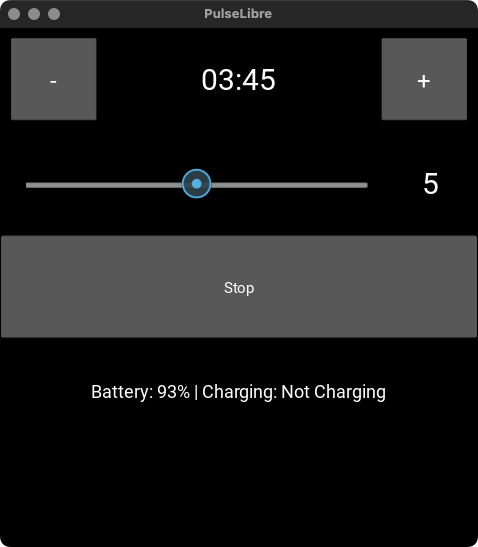

# Pulse-Libre Desktop Application

A Kivy application to control the [Pulsetto device](https://pulsetto.myshopify.com/products/meet-pulsetto-v3?sca_ref=6511019.cCZ7LMhOmo) via Bluetooth Low Energy (BLE). The app allows you to set the strength of the device, start a timer, and monitor battery and charging status.

This app is designed for desktop platforms (MacOS, should work on Linux and maybe Windows) and mirrors the functionality of the mobile app available [here](https://github.com/jooray/PulseLibre).


## Screenshot




## Features

- Scan and connect to [Pulsetto devices](https://pulsetto.myshopify.com/products/meet-pulsetto-v3?sca_ref=6511019.cCZ7LMhOmo) automatically.
- Set strength levels from 1 to 9.
- Start and stop a timer (default 4 minutes).
- Display battery level and charging status.
- Compatible with desktop platforms (Windows, macOS, Linux).

## Prerequisites

- Python 3.7 or higher
- [Poetry](https://python-poetry.org/docs/#installation) package manager

## Installation

1. **Clone the repository**

   ```bash
   git clone https://github.com/jooray/pulse-libre-desktop.git
   cd pulsetto-libre-desktop
   ```

2. **Install dependencies using Poetry**

   ```bash
   poetry install
   ```

## Running the Application

   ```bash
   poetry run python main.py
   ```
## Usage

- Upon starting, the app will attempt to scan and connect to a Pulsetto device.
- If a device is not found, a "Scan" button will appear. Press it to scan again.
- Once connected, battery level and charging status will be displayed.
- Use the slider to set the desired strength (1-9).
- Press the "Start" button to begin the timer and activate the device.
- Press the "Stop" button to stop the device and the timer.

## Why? Backstory

I was stranded in a car in a storm. The storm took out all the cell towers. With nothing
to do, I decided to do some biohacking, chill out, use some Near Infrarred Light and
do some vagal stimulation to remove the stress of freaking wind that was shaking my car
and throwing over reusable bathrooms around me.

I turned the device on, but it needed to login and go to the internet. Which was of course
not working because of the storm.

Why does an electric nerve stimulator need an account and access to the Internet? I sighed.
A few moments later, I wanted to learn about BLE hacking and reverse engineering. The code
was written mostly by ChatGPT anyway, but I did some nice reverse engineering of the protocol.
The result is this micro app. Have fun.

## Information about Pulsetto device

The device's original app has multiple modes (Stress, Pain, Burnout, ...), but
they are actually all the same, just with different recommendations on how often to do
them and different program lengths. There is no difference in what the device does.

The only thing that you set on your device is the strength level (1-9) and the
app starts a timer.

Get your [Pulsetto device](https://pulsetto.myshopify.com/products/meet-pulsetto-v3?sca_ref=6511019.cCZ7LMhOmo).
